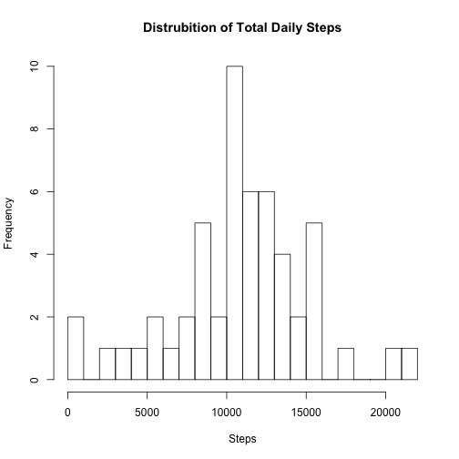
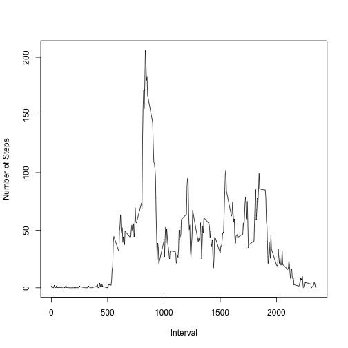
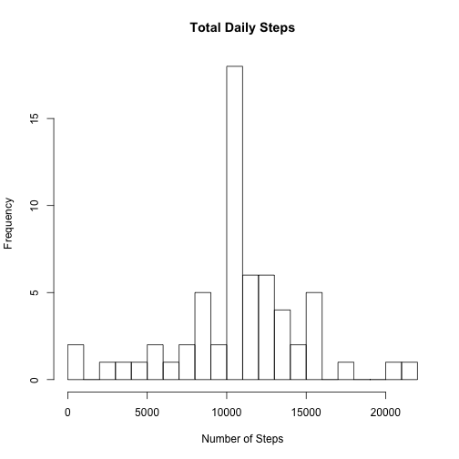
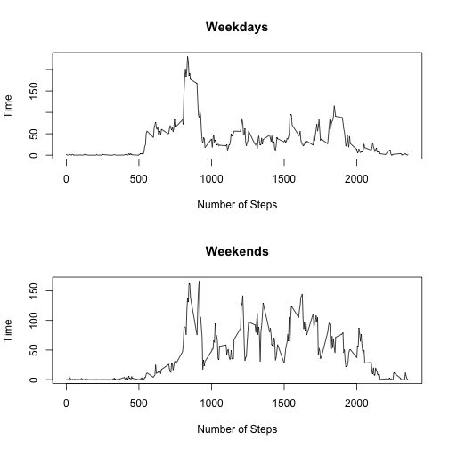

This assignment makes use of data from a personal activity monitoring device. This device collects data at 5 minute intervals through out the day. The data consists of two months of data from an anonymous individual collected during the months of October and November, 2012 and include the number of steps taken in 5 minute intervals each day.

**Data**

The code below reads in the dataset and saves it as an R object.


```r
data <- read.csv("activity.csv")
```

```
## Warning in file(file, "rt"): cannot open file 'activity.csv': No such file
## or directory
```

```
## Error in file(file, "rt"): cannot open the connection
```

**What is mean total number of steps taken per day?**

First, we use the dplyr package to group the data by day, calculate the total  number of steps taken per day, and print the results.


```r
library(dplyr)
day_group <- group_by(data, date)
sums <- summarise(day_group, total_steps = sum(steps))
print(sums, n=61)
```

```
## Source: local data frame [61 x 2]
## 
##          date total_steps
## 1  2012-10-01          NA
## 2  2012-10-02         126
## 3  2012-10-03       11352
## 4  2012-10-04       12116
## 5  2012-10-05       13294
## 6  2012-10-06       15420
## 7  2012-10-07       11015
## 8  2012-10-08          NA
## 9  2012-10-09       12811
## 10 2012-10-10        9900
## 11 2012-10-11       10304
## 12 2012-10-12       17382
## 13 2012-10-13       12426
## 14 2012-10-14       15098
## 15 2012-10-15       10139
## 16 2012-10-16       15084
## 17 2012-10-17       13452
## 18 2012-10-18       10056
## 19 2012-10-19       11829
## 20 2012-10-20       10395
## 21 2012-10-21        8821
## 22 2012-10-22       13460
## 23 2012-10-23        8918
## 24 2012-10-24        8355
## 25 2012-10-25        2492
## 26 2012-10-26        6778
## 27 2012-10-27       10119
## 28 2012-10-28       11458
## 29 2012-10-29        5018
## 30 2012-10-30        9819
## 31 2012-10-31       15414
## 32 2012-11-01          NA
## 33 2012-11-02       10600
## 34 2012-11-03       10571
## 35 2012-11-04          NA
## 36 2012-11-05       10439
## 37 2012-11-06        8334
## 38 2012-11-07       12883
## 39 2012-11-08        3219
## 40 2012-11-09          NA
## 41 2012-11-10          NA
## 42 2012-11-11       12608
## 43 2012-11-12       10765
## 44 2012-11-13        7336
## 45 2012-11-14          NA
## 46 2012-11-15          41
## 47 2012-11-16        5441
## 48 2012-11-17       14339
## 49 2012-11-18       15110
## 50 2012-11-19        8841
## 51 2012-11-20        4472
## 52 2012-11-21       12787
## 53 2012-11-22       20427
## 54 2012-11-23       21194
## 55 2012-11-24       14478
## 56 2012-11-25       11834
## 57 2012-11-26       11162
## 58 2012-11-27       13646
## 59 2012-11-28       10183
## 60 2012-11-29        7047
## 61 2012-11-30          NA
```

Now we create a histogram of the total steps per day.


```r
 hist(sums$total_steps, main = "Distrubition of Total Daily Steps", xlab = "Steps",
      breaks = 20)
```

 

Next, we calculate the mean median of the total number of steps taken each day.


```r
mean(sums$total_steps, na.rm = TRUE)
```

```
## [1] 10766.19
```

```r
median(sums$total_steps, na.rm = TRUE)
```

```
## [1] 10765
```

**What is the average daily activity pattern?**

Next, we want to visualize the average daily activity pattern. To do this, we average across all days at each 5-minute interval and plot the results.


```r
by_interval <- group_by(data, interval)
avg_interval <- summarise(by_interval, avg_steps = mean(steps, na.rm = T))
plot(x = avg_interval$interval, y = avg_interval$avg_steps, type = "l",
     xlab = "Interval", ylab = "Number of Steps")
```

 

In this plot, we see that there is very little activity at the beginning (i.e. midnight). At around the 5AM, we begin to see more activity, with a large spike in the 8AM-9AM range. Actitvity comes back down by 10AM and is variable throughout much of the day, and begins to taper off toward very little activity starting at around 7PM.

What if we want to know which exact 5-minute interval contiained, on average, the most steps? The code below calculates that for us:


```r
avg_interval[which.max(avg_interval$avg_steps), ]
```

```
## Source: local data frame [1 x 2]
## 
##   interval avg_steps
## 1      835  206.1698
```

There we have it. The most activity occurs, on average, around 8:35AM.

**Imputing missing values**

Thus far we have ignored missing values. Let's instead use the data we have to make a guess about what those values would be. First, let's find out how many missing datapoints we have.


```r
summary(data)
```

```
##      steps                date          interval     
##  Min.   :  0.00   2012-10-01:  288   Min.   :   0.0  
##  1st Qu.:  0.00   2012-10-02:  288   1st Qu.: 588.8  
##  Median :  0.00   2012-10-03:  288   Median :1177.5  
##  Mean   : 37.38   2012-10-04:  288   Mean   :1177.5  
##  3rd Qu.: 12.00   2012-10-05:  288   3rd Qu.:1766.2  
##  Max.   :806.00   2012-10-06:  288   Max.   :2355.0  
##  NA's   :2304     (Other)   :15840
```

The output tells us that there are 2,304 missing datapoints. Now, let's impute those missing datapoints by replacing them with the mean for that interval, avergaing across days. 


```r
suppressWarnings(aggdata <- aggregate(data, by = list(data$interval), FUN = mean, 
                                      na.rm = TRUE, warn = -1))
imputed <- data
for (i in 1:nrow(imputed)) {
     ifelse(is.na(imputed$steps[i]),
            imputed$steps[i] <- aggdata[which(aggdata$interval == imputed$interval[i]), 2],
            imputed$steps[i] <- imputed$steps[i])
     }
```

Now, once again, let's calculate the mean and median number of steps at each interval, and make a histogram of the distribution.


```r
imputed_day_group <- group_by(imputed, date)
imputed_sums <- summarise(imputed_day_group, total_steps = sum(steps))
mean(imputed_sums$total_steps)
```

```
## [1] 10766.19
```

```r
median(imputed_sums$total_steps)
```

```
## [1] 10766.19
```

```r
hist(imputed_sums$total_steps, breaks = 20, main = "Total Daily Steps",
     xlab = "Number of Steps")
```

 

As a result, we find that the mean is the same, but the median has shifted slightly (and is now equal to the mean).

**Are there differences in activity patterns between weekdays and weekends?**

First, let's classify each day as either a weekday or a weekend. To do this, we must first change the date variable into the class POSIXt.


```r
imputed$date <- as.POSIXlt(imputed$date)
imputed$dayofweek <- weekdays(imputed$date)
imputed$daytype <- ifelse(imputed$dayofweek %in% c("Monday", "Tuesday", "Wednesday",
                                                   "Thursday", "Friday"),
                          c("weekday"), c("weekend"))
```

Now, let's plot the data, averaged across the type of day (i.e. either weekday or weekend.)


```r
weekdays <- imputed[imputed$daytype == "weekday", ]
weekdays$date <- as.Date(weekdays$date)
weekday_by_interval <- group_by(weekdays, interval)
avg_wkday <- summarise(weekday_by_interval, avg_wkdy_steps = mean(steps))

weekends <- imputed[imputed$daytype == "weekend", ]
weekends$date <- as.Date(weekends$date)
weekend_by_interval <- group_by(weekends, interval)
avg_wknd <- summarise(weekend_by_interval, avg_wknd_steps = mean(steps))

par(mfrow=c(2,1))

plot(x = avg_wkday$interval, y = avg_wkday$avg_wkdy_steps, type = "l",
     main = "Weekdays", xlab = "Number of Steps", ylab = "Time")
plot(x = avg_wknd$interval, y = avg_wknd$avg_wknd_steps, type = "l",
     main = "Weekends", xlab = "Number of Steps", ylab = "Time")
```

 
